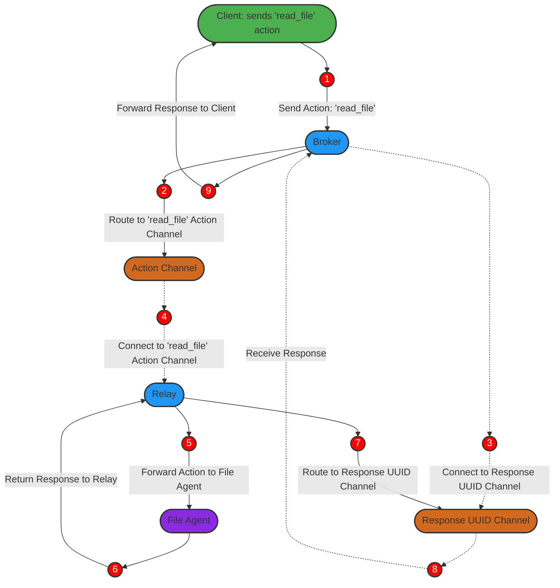

# Routing System Project

## Purpose and Overview
The Routing System is a powerful solution designed to transform the way clients interact with services, allowing them to send specific actions without needing to understand underlying dependencies, infrastructure, or service logic. This system promotes a modular, decoupled, and scalable architecture where each service is independently developed, managed, and maintained.

Imagine a client sending a "read_file" request. Instead of connecting directly to a specific file service, the client simply sends the action through this routing system, which then handles all complexities of routing, processing, and responding. This lets clients focus solely on their actions, while the system efficiently manages delivery to the correct handler.

### Why This System is Unique
Unlike traditional messaging systems, this architecture introduces several unique capabilities:

- **UUID-Based Response Routing**: Each client request generates a unique response channel based on a UUID, allowing precise response handling and reducing message collisions. This approach ensures each client receives the correct response, tied directly to the original action.
- **Bidirectional gRPC Flow**: Using a gRPC bidirectional stream, the system maintains a live, stateful connection with clients, allowing messages and responses to flow seamlessly in real-time, without complex client-side logic.
- **Dynamic Routing and Scalability**: The system supports high message volumes and dynamically routes actions to specific services or relays, adapting to infrastructure scaling demands on various platforms.
- **Customizable Action Handling**: New actions or services can be added without impacting existing clients. Each action has its own unique handling, with complete flexibility to manage actions independently.

### Key Problems Solved
This system is designed to solve some fundamental problems that arise in complex service ecosystems:

- **Decoupling Dependencies**: By abstracting the client from service-specific logic, the system allows independent evolution of services. Clients no longer need updates when services or back-end infrastructure change, reducing operational overhead and maintenance.
- **Reliable Asynchronous Processing**: Ensures that each message follows a reliable flow with response tracking. Even in cases of temporary disconnection, the system maintains a persistent UUID-based queue to deliver responses reliably.
- **Efficient Resource Management**: With connection-based routing and scalable action handling, resources are optimized, reducing costs and preventing unnecessary load on services.
- **Enhanced Observability and Control**: Full visibility into the message lifecycle, allowing administrators to track, audit, and monitor each action and response. This helps identify potential bottlenecks or failures early, increasing system resilience.

## Key Benefits
- **Simplicity for Clients**: Clients only need to specify an action, such as "read_file". The routing system takes care of complex message delivery to the appropriate service without requiring client involvement in infrastructure details.
- **High Adaptability**: Easily integrates new actions or services, allowing the system to evolve over time. Teams can add functionalities without disrupting existing clients, enabling quick adaptation to changing business needs.
- **Real-Time and Resilient Communication**: The gRPC bidirectional stream provides real-time interaction, while UUID-based routing and message persistence ensure reliable responses even under varying network conditions.
- **Platform Flexibility**: Designed to be deployed on various infrastructures, the system can leverage different scaling and messaging tools based on the platform, without compromising on functionality.

## High-Level Architecture
The system consists of the following core components:

1. **Broker**: Acts as the entry point for client messages, receiving actions like "read_file", generating a unique ID if needed, and routing the message to the appropriate message queue based on the action specified.
2. **Relay**: Listens to the action-specific message queue and forwards the action to the designated handler service, known as the `Agent`.
3. **Agent**: Processes the action and sends a response back through the Relay, which then forwards the response to the correct UUID-based response queue, allowing the Broker to send the final response back to the client.

## Documentation Index
- [Broker Component](./docs/components/broker.md): Entry point for client messages, responsible for generating UUIDs and routing actions.
- [Relay Component](./docs/components/relay.md): Connects to action queues and forwards messages to the Agent.
- [Agent Component](./docs/components/agent.md): Processes specific actions and returns responses through the Relay.
- [Message Queue Configuration](./docs/components/message_queue.md): Configuration details for action channels and response queues.
- [gRPC Interface](./docs/components/grpc_interface.md): Specifications and methods for bidirectional gRPC communication.

## Example Flow: "read_file" Action
To illustrate the message flow, let’s follow an example where a client sends a "read_file" action:

1. **Client** sends a `"read_file"` action to the **Broker** via a bidirectional gRPC connection.
2. **Broker** generates a unique ID (UUID) for the action if the client didn’t provide one and assigns a timestamp to the message.
3. **Broker** routes the action to the **Message Queue** specifically designated for `"read_file"` actions.
4. **Broker** then establishes a persistent connection to a **Response Queue** uniquely identified by the UUID, where it will listen for a response tied to the action ID.
5. **Relay** connects to the **Message Queue** for `"read_file"` actions, where it receives the message and forwards it to the **Agent**.
6. **Agent** processes the action by performing the requested operation (e.g., reading the file) and prepares a response.
7. **Agent** sends the response back to the **Relay**.
8. **Relay** routes the response to the **UUID-based Response Queue**, associating it with the correct action ID for tracking.
9. **Broker** listens on the **UUID-based Response Queue**, where it identifies the response by the action ID.
10. **Broker** forwards the response to the **Client** through the gRPC connection, completing the cycle.

## Macro Architecture Diagram
The following diagram provides a visual representation of this flow, illustrating how each component interacts to complete the action processing cycle.

---

This project offers a robust, scalable, and flexible approach to routing client actions, leveraging real-time communication and unique message tracking to enhance reliability, adaptability, and overall system simplicity.
