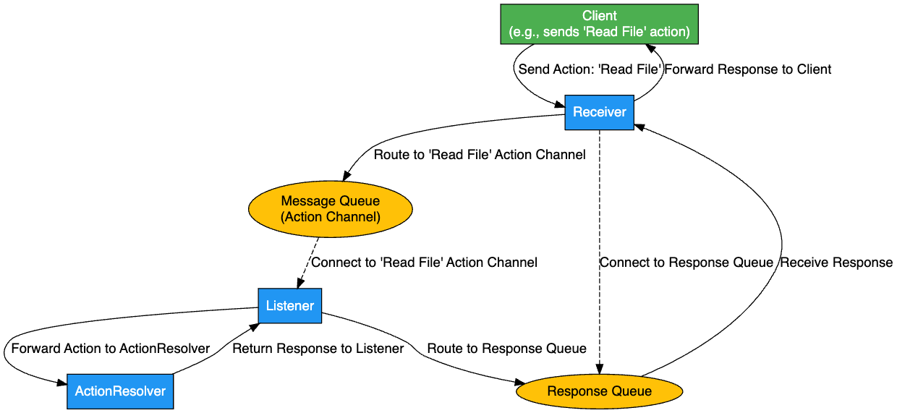

# Routing System Project

## Purpose and Overview
The Routing System is designed to streamline and simplify how clients interact with services by allowing them to send specific actions without needing to know the underlying dependencies or service logic. This setup promotes a modular and scalable architecture where each service is independently developed, managed, and maintained.

Imagine a client sending a "Read File" request. Instead of connecting directly to a file service, the client sends the action through this routing system, which then handles the complexities of routing, processing, and responding. This enables clients to focus solely on their actions while the system efficiently manages the delivery to the correct handler.

### Why Use This System?
- **Decoupling of Dependencies**: Clients are fully abstracted from knowing which services will process their actions. This keeps client applications lightweight and reduces the need for frequent updates when services change.
- **Scalability**: The system supports high message volumes and can be deployed on a variety of platforms, adapting to different scaling methods based on infrastructure needs.
- **Flexible Action Handling**: New actions and services can be added seamlessly, allowing the system to grow and evolve without requiring major architectural changes.
- **Reliable Message Flow**: The system ensures consistent handling of actions with configurable response times and reconnection support, so that client interactions remain stable even under varying conditions.

## Key Benefits
- **Simplicity for Clients**: Clients only need to specify an action, such as "Read File", and the system takes care of routing and delivering messages to the appropriate service.
- **Asynchronous Communication**: Messages are processed in an asynchronous manner, enhancing responsiveness and enabling non-blocking operations for clients.
- **Adaptability**: Easily integrates new actions or services, allowing teams to scale functionality over time with minimal disruption to existing clients.

## High-Level Architecture
The system consists of the following core components:

1. **Receiver**: Acts as the entry point for client messages, receiving actions like "Read File", generating an ID if needed, and routing the message to the appropriate message queue based on the action specified.
2. **Listener**: Listens to the action-specific message queue and forwards the action to the designated handler service, known as the `ActionResolver`.
3. **ActionResolver**: Processes the action and sends a response back through the Listener, which then forwards the response to the correct response queue, allowing the Receiver to send the final response back to the client.

## Example Flow: "Read File" Action
To illustrate the message flow, let’s follow an example where a client sends a "Read File" action:

1. **Client** sends a `"Read File"` action to the **Receiver**.
2. **Receiver** routes the action to the **Message Queue** specifically designated for `"Read File"`.
3. **Listener** connects to this **Message Queue** to receive `"Read File"` actions and forwards the message to the **ActionResolver**.
4. **ActionResolver** processes the action, reads the requested file, and sends the response back to the **Listener**.
5. **Listener** routes the response to the **Response Queue**.
6. **Receiver** receives the response from the **Response Queue** and forwards it to the **Client**.

## Macro Architecture Diagram
The following diagram provides a visual representation of this flow, illustrating how each component interacts to complete the action processing cycle.

## Macro Architecture Diagram

