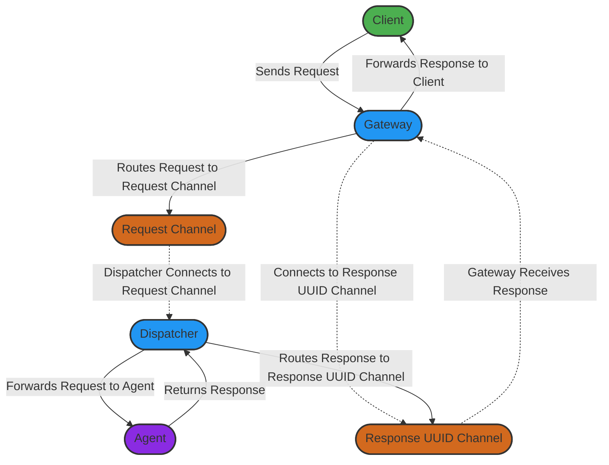

# Architectural Diagrams

The following diagram provides a high-level overview of the Agenet system architecture, illustrating the core components and general flow of communication between them.

## High-Level System Architecture

## Summary
This high-level architecture diagram shows the main components of Agenet and their general communication pathways. The Client interacts with the Gateway to send requests. The Gateway, in turn, routes requests to the appropriate Request Channel, while keeping a connection to a Response UUID Channel. The Dispatcher listens on the Request Channel, forwarding requests to the relevant Agent based on the request type.

Upon receiving a response from an Agent, the Dispatcher routes the response back through the Response UUID Channel, where the Gateway retrieves it and forwards it to the original Client.

These interactions illustrate Agenet's capability to decouple client requests from specific agent details, supporting a scalable and modular system.
