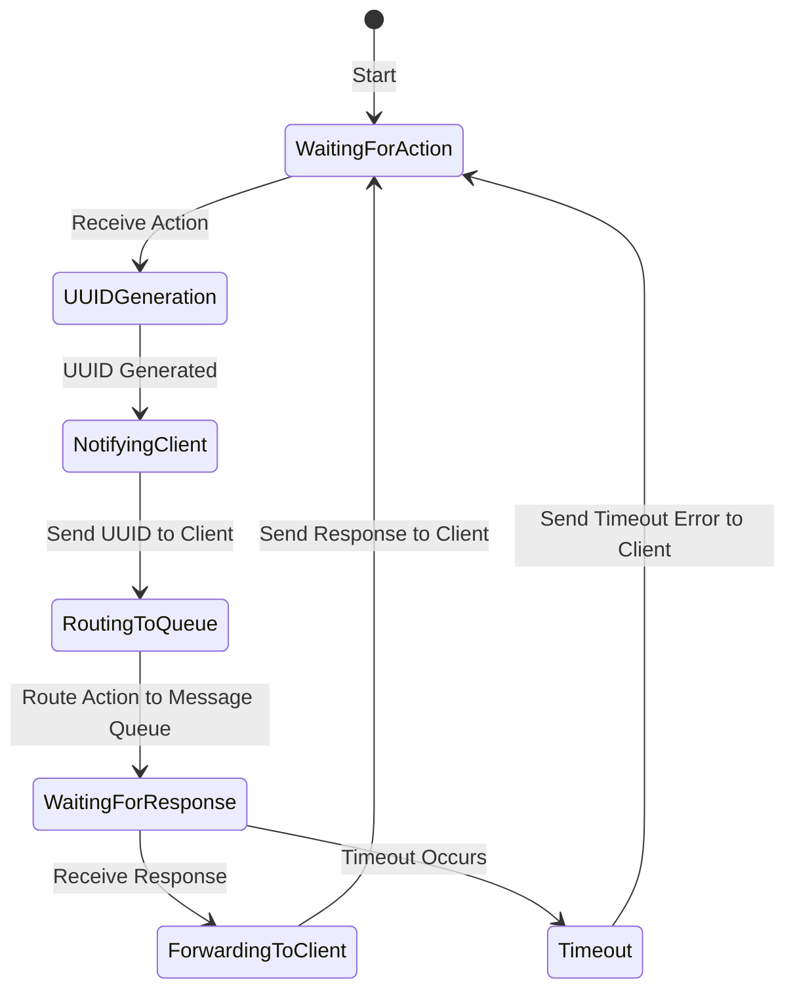

# Broker Component Documentation

The **Broker** component serves as the central entry point for client messages in the Routing System. It is responsible for receiving actions, generating unique identifiers (UUIDs) when needed, and routing messages to the appropriate action-specific channels. The Broker also manages the return path by listening to UUID-based response queues, ensuring the correct delivery of responses back to clients.

## Purpose of the Broker
The Broker decouples clients from the underlying services by abstracting the routing logic. By handling UUID generation, action routing, and response forwarding, it allows clients to focus solely on the actions they want to perform without needing to manage complex routing details.

## Key Responsibilities
1. **Receiving Actions**: The Broker receives action messages from clients via a gRPC bidirectional stream.
2. **UUID Generation**: If an action message arrives without an identifier, the Broker generates a unique UUID for tracking and response handling.
3. **Routing to Message Queue**: Based on the action specified, the Broker routes the message to the appropriate action-specific message queue.
4. **Listening for Responses**: The Broker establishes a connection to a UUID-based response queue to listen for the response associated with each action.
5. **Forwarding Responses to Clients**: Once a response is received, the Broker forwards it back to the client, completing the request-response cycle.

## Process Flow for Broker Component
1. **Receive Action**: The Broker receives an action from the client through a gRPC connection.
2. **Generate UUID if Missing**: If the action lacks an ID, the Broker generates a UUID and attaches it to the message.
3. **Send UUID to Client**: The Broker immediately sends the UUID back to the client, allowing the client to reconnect using this ID if needed.
4. **Route to Action Queue**: The Broker routes the message to the designated action queue, such as the queue for `read_file` actions.
5. **Connect to Response Queue**: The Broker connects to a UUID-based response queue associated with the action ID to wait for the processed response.
6. **Wait for Response**: The Broker waits on the UUID-based queue until a response is received or a timeout occurs.
7. **Forward Response to Client**: When the response is received, the Broker forwards it back to the client, completing the interaction.

## State Diagram of Broker

## Error Handling
- **Timeout**: If the Broker does not receive a response within a configured time, it notifies the client of a timeout error and discards the message.
- **Message Routing Errors**: If routing fails due to queue issues or network errors, the Broker logs the error and sends a failure notification to the client.

## Configuration Options
- **Timeout Duration**: Defines how long the Broker waits for a response before timing out.
- **Queue Configuration**: Specifies the action channels the Broker should route messages to (e.g., `read_file`, `write_file`).
- **Error Handling Settings**: Configures policies for handling errors, such as message retries or logging options.

---

The Broker component is essential for the Routing System, providing a robust interface for clients to interact with services in a decoupled, reliable manner. By managing UUIDs, routing, and response tracking, it ensures a seamless message flow and response handling across the system.
