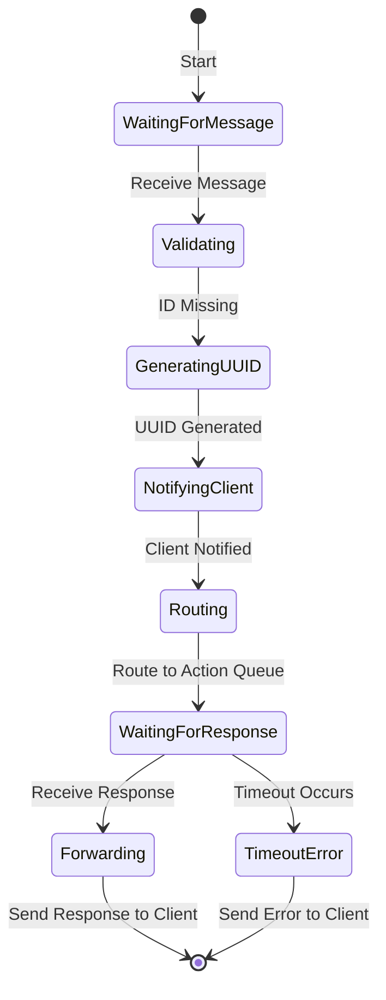

# Receiver Component

## Overview
The **Receiver** acts as the entry point for client messages within the Routing System. It establishes a bidirectional gRPC connection with clients, enabling real-time communication for actions and responses. The Receiver's responsibilities include validating incoming actions, converting actions to snake case if necessary, generating unique IDs, routing messages to the correct action channels, and handling response delivery to the client.

## Key Responsibilities
1. **ID Generation**: Generates a unique UUID for each action if the client does not provide an ID, ensuring traceability and accurate routing.
2. **Action Formatting**: Converts the `action` field to snake case (e.g., converting `"ReadFile"` or `"readFile"` to `"read_file"`) for consistency across the system.
3. **Routing Messages**: Routes each message to the designated **Message Queue** based on the standardized action name, and establishes a persistent connection to the **UUID-based Response Queue**.
4. **Timeout and Reconnection Management**: Monitors each action's response time, with configurable timeouts, and manages reconnection logic if necessary.

## Detailed Workflow
1. **Message Reception**:
   - The Receiver listens for incoming action messages from clients via gRPC.
   - When a message arrives, it checks for an `id`. If absent, the Receiver generates a UUID and assigns a timestamp to the message.
   - The `action` field is automatically converted to snake case format (e.g., `"Read File"` becomes `"read_file"`) to maintain uniformity across all actions.

2. **Routing to Message Queue**:
   - Based on the standardized `action` field in the message (e.g., `"read_file"`), the Receiver routes the message to the **Message Queue** designated for that action.
   - It maintains a persistent connection to the **UUID-based Response Queue**, where it will listen for responses specific to this action ID.

3. **Establishing Response Queue Connection**:
   - After routing to the Message Queue, the Receiver establishes a connection to a unique **Response Queue**, labeled with the generated UUID. This queue is created dynamically for each action, allowing precise response handling and ensuring each client receives the correct response.

4. **Timeout Management**:
   - If a response is not received within a specified timeout period, the Receiver sends a timeout error back to the client. Timeout values are configurable, allowing clients to specify how long they are willing to wait for a response.

5. **Receiving and Forwarding Response**:
   - Once the response arrives in the UUID-based Response Queue, the Receiver retrieves it, verifies the action ID, and forwards the response to the client, completing the communication cycle.

## Configuration Options
- **Timeout Configuration**: Allows specification of maximum wait time for responses. Can be set globally or overridden per action based on client specifications.
- **Reconnection Logic**: Configurable reconnection handling in cases of temporary network issues or disconnections, ensuring the Receiver can reconnect without losing track of active requests.

## Example Payload
The following is an example of a payload received by the Receiver, with an action formatted in snake case:

```json
{
  "id": "generated-uuid-if-none-provided",
  "action": "read_file",
  "type": "string",
  "value": "file_id_123",
  "metadata": {
    "example_key": "example_value"
  }
}
```


