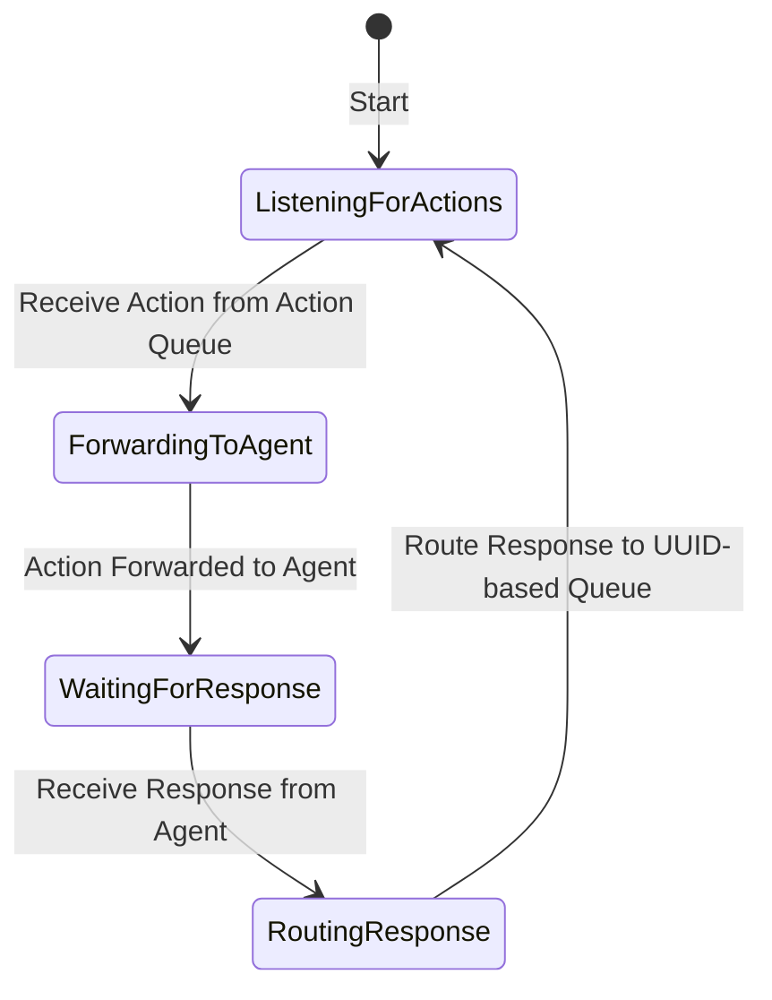

# Relay Component Documentation

The **Relay** component is responsible for listening to specific action channels and forwarding those actions to the correct handler, referred to as the `Agent`. Once the action is processed, the Relay routes the response back through the appropriate UUID-based response queue, ensuring the message is delivered correctly to the **Broker**.

## Purpose of the Relay
The Relay serves as an intermediary between the **Broker** and the **Agent** components. It subscribes to action-specific message queues, receives actions from the **Broker**, and transmits them to the correct **Agent** for processing. This decoupling allows for scalable and modular handling of various actions.

## Key Responsibilities
1. **Listening to Action Queues**: The Relay connects to action-specific message queues (e.g., `read_file` queue) to receive actions sent by the **Broker**.
2. **Forwarding to Agent**: Upon receiving an action, the Relay routes the message to the designated **Agent**, which processes the action.
3. **Routing Responses**: After the **Agent** processes an action, the Relay receives the response and routes it to the UUID-based response queue, associated with the correct action ID.

## Process Flow for Relay Component
1. **Connect to Action Queue**: The Relay subscribes to a specific action queue (e.g., `read_file`) to receive relevant messages.
2. **Receive Action**: Once a message is received from the action queue, the Relay forwards it to the appropriate **Agent**.
3. **Wait for Agent Response**: The Relay waits for a response from the **Agent** after the action has been processed.
4. **Route to Response Queue**: Upon receiving a response, the Relay routes it to the UUID-based response queue, ensuring it matches the correct action ID.
5. **Notify Broker**: The **Broker** listens to the UUID-based response queue to receive the processed response, which it then forwards to the original client.

## State Diagram of Relay

## Error Handling
- **Timeout**: If an **Agent** fails to respond within a configured timeout, the Relay will log an error and discard the message, notifying the **Broker** of the timeout.
- **Failed Processing**: If the **Agent** cannot process an action, an error response is routed back to the UUID-based response queue, allowing the **Broker** to handle it appropriately.

## Configuration Options
- **Action Queue Subscription**: Allows for dynamic configuration of the action channels the Relay should subscribe to (e.g., read_file, write_file).
- **Timeout Settings**: Configurable timeout for waiting on **Agent** responses to prevent indefinite waiting.
- **Error Handling Policies**: Configuration for how to handle various errors, such as timeout and failed processing.

---

The Relay is a vital component that maintains the flow of messages between the **Broker** and **Agent**, ensuring smooth, reliable message processing and response handling across the system.
