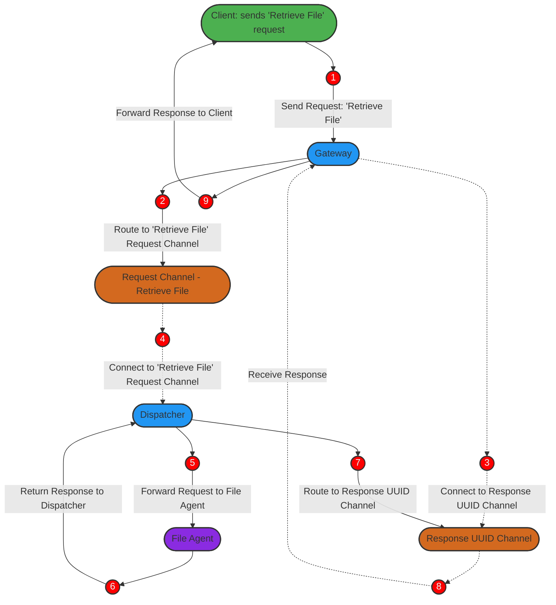

# Message Flow Examples

To better understand the inner workings of Agenet, this section provides example flows showing how requests are routed from clients to agents, processed, and returned.

## Example Flow: "Retrieve File" Request

In this example, a client sends a **Retrieve File** request. This flow illustrates how the system manages the request and routes it to the appropriate agent.

1. **Client** sends a `"Retrieve File"` request to the **Gateway** via a bidirectional gRPC connection.
2. **Gateway** generates a unique ID (UUID) for the request if the client didn’t provide one and assigns a timestamp to the request.
3. **Gateway** routes the request to the **Request Channel** specifically designated for `"Retrieve File"`.
4. **Gateway** then establishes a persistent connection to a **Response UUID Channel** uniquely identified by the UUID, where it will listen for a response tied to the request ID.
5. **Dispatcher** connects to the **Request Channel** for `"Retrieve File"`, where it receives the request and forwards it to the **Agent**.
6. **Agent** processes the request by performing the necessary operation (e.g., retrieving the file) and prepares a response.
7. **Agent** sends the response back to the **Dispatcher**.
8. **Dispatcher** routes the response to the **UUID-based Response Channel**, associating it with the correct request ID for tracking.
9. **Gateway** listens on the **UUID-based Response Channel**, where it identifies the response by the request ID.
10. **Gateway** forwards the response to the **Client** through the gRPC connection, completing the cycle.

## Example Flow Diagram

The following diagram illustrates this flow in a visual format.

This example demonstrates Agenet’s ability to manage request routing and response delivery effectively, maintaining a persistent connection from client to agent and back.
