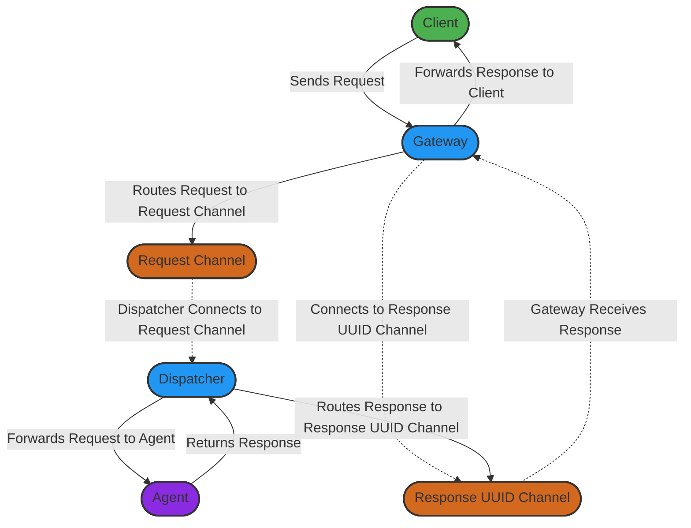

# Agenet - Agent Network

## Introduction
Agenet, short for **Agent Network**, is inspired by Usenet's concept of a **User Network**. Just as Usenet created a vast, decentralized system for sharing information between users, Agenet is designed to facilitate seamless communication and task routing among service agents. This system enables clients to send specific requests without needing knowledge of underlying dependencies, service locations, or infrastructure.

Agenet promotes a modular, decoupled, and scalable architecture where each service is independently developed, managed, and maintained. Through this network, clients and agents communicate efficiently, focusing solely on requests while Agenet handles all complexities of routing, processing, and response.

### Documentation Index

- [Agenet - Agent Network](#agenet---agent-network)
  - [Introduction](#introduction)
    - [Documentation Index](#documentation-index)
    - [Purpose](#purpose)
      - [Key Purpose of Agenet](#key-purpose-of-agenet)
    - [Technical Benefits](#technical-benefits)
      - [Key Technical Benefits](#key-technical-benefits)
    - [Practical Benefits](#practical-benefits)
      - [Key Practical Benefits](#key-practical-benefits)
  - [System Components](#system-components)
    - [Core Components](#core-components)
      - [1. Gateway](#1-gateway)
      - [2. Dispatcher](#2-dispatcher)
      - [3. Agent](#3-agent)
  - [Communication Patterns](#communication-patterns)
    - [Core Communication Patterns](#core-communication-patterns)
      - [1. UUID-Based Response Routing](#1-uuid-based-response-routing)
      - [2. Bidirectional gRPC Streams](#2-bidirectional-grpc-streams)
      - [3. Request-Based Routing](#3-request-based-routing)
      - [4. Persistent Response Channels](#4-persistent-response-channels)
  - [Architectural Diagrams](#architectural-diagrams)
    - [High-Level System Architecture](#high-level-system-architecture)
    - [Summary](#summary)

---

This project offers a robust, scalable, and flexible approach to routing client requests, leveraging real-time communication and unique message tracking to enhance reliability, adaptability, and overall system simplicity.

### Purpose

Agenet, or **Agent Network**, serves as a flexible routing system that allows clients to send specific requests without needing knowledge of the underlying infrastructure or dependencies.

#### Key Purpose of Agenet
- **Simplified Client Integration**: Agenet enables clients to send and receive requests without directly interacting with specific services. This abstraction allows the client applications to remain lightweight and decoupled from the service architecture.
- **Modular and Scalable Design**: By separating client interactions from service-specific logic, Agenet promotes a highly modular and scalable system that can grow and adapt with minimal disruption to existing clients or agents.
- **Seamless Communication between Clients and Agents**: Agenet manages the complexities of routing, processing, and responding to client requests, allowing both clients and agents to focus on their core responsibilities.

Agenet’s purpose is to provide a robust solution for managing asynchronous requests in real-time, empowering a diverse ecosystem of services to communicate efficiently within a unified framework.

### Technical Benefits

Agenet introduces several technical advantages that enhance the robustness, scalability, and reliability of client-agent communications in distributed systems.

#### Key Technical Benefits

- **UUID-Based Response Routing**: By generating unique response channels for each client request using UUIDs, Agenet ensures precise handling of responses, reducing the risk of message collision and improving tracking.

- **Bidirectional gRPC Communication**: Agenet uses bidirectional gRPC streams to maintain a stateful connection between clients and agents, enabling real-time messaging and streamlined communication without requiring complex logic on the client side.

- **Dynamic Routing and Scalability**: Designed for high-volume request handling, Agenet dynamically routes requests to designated agents, ensuring efficient load distribution. Its architecture supports scaling based on infrastructure needs, adapting seamlessly across various platforms.

- **Customizable Request Handling**: Agenet provides the flexibility to add new request types and agent services without impacting existing clients. This modularity supports independent evolution and extension of system capabilities.

These technical benefits allow Agenet to handle large-scale, asynchronous interactions efficiently, ensuring that both clients and agents can operate independently while still communicating effectively within the network.

### Practical Benefits

Agenet offers several practical advantages that simplify client interactions and improve operational efficiency for distributed systems.

#### Key Practical Benefits

- **Simplified Client Integration**: Agenet abstracts the complexities of service connections, allowing clients to focus on sending requests without needing to know the details of service locations or dependencies. This reduces client-side complexity and minimizes the need for frequent updates when services change.

- **Resilient Communication and Real-Time Interaction**: Through bidirectional gRPC streams and UUID-based routing, Agenet enables robust real-time communication. Even during temporary disconnections, the system ensures reliable message delivery, improving stability in distributed environments.

- **Seamless Adaptability for Growing Ecosystems**: With Agenet, new request types and agents can be integrated into the system without disrupting existing workflows. This adaptability allows businesses to scale and modify their services as needed, ensuring long-term flexibility.

- **Platform Agnostic and Infrastructure Flexibility**: Agenet is designed to work across a variety of infrastructures, allowing for deployment on different platforms. It adapts to scaling requirements based on the hosting environment, without sacrificing functionality.

These practical benefits make Agenet an ideal solution for organizations looking to simplify client-service interactions, maintain flexible service architectures, and improve overall resilience in their distributed networks.

## System Components

Agenet is structured around three core components, each serving a unique role to ensure efficient communication and routing between clients and agents.

### Core Components

#### 1. Gateway
The **Gateway** acts as the entry point for client requests. It receives incoming requests from clients, generates a unique ID (UUID) if one is not provided, and routes the request to the appropriate channel in the system.

- **Functionality**: Handles the initial reception of client requests, manages UUID assignment, and initiates message routing.
- **Role**: Serves as the primary interface between clients and Agenet, abstracting the complexities of the backend services from the client side.

#### 2. Dispatcher
The **Dispatcher** manages and directs requests to their corresponding agents. It is where agents connect to listen for specific request types, enabling a modular and scalable approach for request handling.

- **Functionality**: Listens for requests from the Gateway and directs them to the appropriate Agent. It ensures requests are delivered to the correct handler, facilitating efficient task distribution.
- **Role**: Acts as the coordinator for requests, maintaining connections with agents and distributing tasks accordingly.

#### 3. Agent
The **Agent** is responsible for processing specific requests as required by the client. Each Agent specializes in handling a particular type of request and sends responses back through the Dispatcher to reach the original client.

- **Functionality**: Executes the requested tasks and prepares responses.
- **Role**: The endpoint for request processing within Agenet, ensuring each client request is handled by the appropriate service.

These components work in harmony to provide a seamless routing and task handling system, where the Gateway, Dispatcher, and Agents each play a crucial role in enabling asynchronous, real-time interactions.

## Communication Patterns

Agenet leverages several communication patterns to ensure reliable, scalable, and efficient message routing and processing across clients and agents. These patterns define how requests are routed, handled, and responded to within the system.

### Core Communication Patterns

#### 1. UUID-Based Response Routing
Each request initiated by a client is assigned a unique identifier (UUID) if not already provided. This UUID serves as a dedicated response channel, ensuring that each response is correctly matched with its originating request. This pattern prevents message collisions and enables precise response tracking.

- **Purpose**: Isolate and track responses to specific client requests.
- **Benefit**: Allows reliable message handling by uniquely associating responses with individual client requests.

#### 2. Bidirectional gRPC Streams
Agenet utilizes bidirectional gRPC streams to maintain an open, real-time communication channel between clients and the system. This pattern enables clients to send requests and receive responses continuously without re-establishing connections, which is crucial for systems requiring low latency and high responsiveness.

- **Purpose**: Maintain a persistent, low-latency connection between clients and Agenet.
- **Benefit**: Enables real-time interaction with minimal connection overhead, allowing for a seamless flow of requests and responses.

#### 3. Request-Based Routing
Within Agenet, requests are dynamically routed to the appropriate agent based on predefined request channels. The Dispatcher directs these requests to the corresponding agent, ensuring each request is processed by the intended handler.

- **Purpose**: Direct client requests to the correct processing agent.
- **Benefit**: Simplifies client interactions by handling routing logic within the system, allowing agents to handle specific requests efficiently.

#### 4. Persistent Response Channels
Upon receiving a request, the Gateway establishes a connection to a dedicated response channel tied to the request’s UUID. This connection persists until the response is delivered, ensuring that no message is lost even in cases of temporary disconnection.

- **Purpose**: Ensure reliable message delivery and response persistence.
- **Benefit**: Enhances message resilience, allowing Agenet to handle temporary network issues without impacting client experience.

These patterns together enable Agenet to maintain a robust and flexible messaging infrastructure, where each component (Gateway, Dispatcher, and Agent) operates within clearly defined channels, ensuring efficient and accurate message delivery.

## Architectural Diagrams

The following diagram provides a high-level overview of the Agenet system architecture, illustrating the core components and general flow of communication between them.

### High-Level System Architecture

### Summary
This high-level architecture diagram shows the main components of Agenet and their general communication pathways. The Client interacts with the Gateway to send requests. The Gateway, in turn, routes requests to the appropriate Request Channel, while keeping a connection to a Response UUID Channel. The Dispatcher listens on the Request Channel, forwarding requests to the relevant Agent based on the request type.

Upon receiving a response from an Agent, the Dispatcher routes the response back through the Response UUID Channel, where the Gateway retrieves it and forwards it to the original Client.

These interactions illustrate Agenet's capability to decouple client requests from specific agent details, supporting a scalable and modular system.
